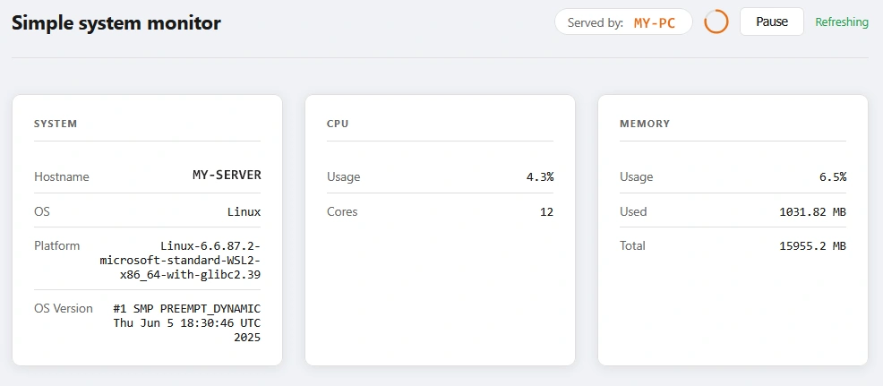

# simple-infra-monitor

A lightweight dockerized Python backend that serves host machine system metrics to a JavaScript frontend.

Designed to be deployed with a separate backend and frontend container, making it suitable for multiserver infrastructure setups where the frontend proxies metrics from a remote backend.


---

## Architecture

```
Browser
   |
Frontend container  (Flask, port 8080)
   |  - serves the UI
   |  - adds its own hostname to the response
   |  - proxies /api/metrics from the backend
   |
Backend container   (Flask, port 5000)
      - collects host metrics (CPU, memory, OS info)
      - exposes /api/metrics as JSON
      - exposes /metrics in Prometheus format
      
```

The frontend and backend are intentionally separate so they can run on different machines. The frontend reports which host served the request, while the backend reports its own system metrics.

---

## Metrics Displayed

- Responding web server hostname
- Backend hostname
- OS type and version
- Platform string
- CPU usage (%) and core count
- Memory usage (%), used, and total

---

## Quick Start

The easiest way to run both components locally is with Docker Compose.

```bash
git clone https://github.com/DreXtrime/simple-infra-monitor.git
cd simple-infra-monitor
docker compose up --build
```

Then open `http://localhost:8080` in your browser.

---
## Using Pre-built Images

Pre-built images are published to GitHub Container Registry and used for production deployment.

**Backend:**
```bash
docker pull ghcr.io/drextrime/infra-backend:latest
docker run -d --name infra-backend \
  --restart unless-stopped \
  -p 5000:5000 \
  ghcr.io/drextrime/infra-backend:latest
```

**Frontend:**
```bash
docker pull ghcr.io/drextrime/infra-frontend:latest
docker run -d --name infra-frontend \
  --restart unless-stopped \
  -e BACKEND_URL=http://:5000 \
  -p 8080:8080 \
  ghcr.io/drextrime/infra-frontend:latest
```

---

## Running Separately

If you want to run the backend and frontend on different machines, you can also build and run each container individually.

**Backend** (on the app server):

```bash
cd backend
docker build -t infra-backend .
docker run -d --name backend -p 5000:5000 --restart unless-stopped infra-backend
```

**Frontend** (on each web server):

```bash
cd frontend
docker build -t infra-frontend .
docker run -d --name frontend \
  -e BACKEND_URL=http://<backend-ip>:5000 \
  -p 8080:8080 \
  --restart unless-stopped \
  infra-frontend
```

---

## Environment Variables

| Variable        | Default                              | Description                               |
|-----------------|--------------------------------------|-------------------------------------------|
| `PORT`          | `5000` (backend) / `8080` (frontend) | Port the service listens on               |
| `HOST`          | `0.0.0.0`                            | Host the service binds to                 |
| `BACKEND_URL`   | `http://localhost:5000`              | Frontend only. URL of the backend service |
| `HOST_HOSTNAME` | `hostname`                           | Pass a custom hostname that gets displayed |

---

## API Endpoints

### `GET /api/metrics`

Returns infrastructure metrics as JSON.

**Backend response:**
```json
{
  "hostname": "appserver",
  "os": "Linux",
  "os_version": "...",
  "platform": "...",
  "cpu_percent": 12.3,
  "cpu_count": 2,
  "memory_percent": 45.1,
  "memory_total_mb": 1024.0,
  "memory_used_mb": 461.2
}
```

**Frontend response:**
```json
{
  "web_server": "webserver01",
  "backend": { ...backend metrics... }
}
```

### `GET /metrics`

Backend only. Returns metrics in Prometheus text format for scraping. Exposes CPU usage, memory usage, and HTTP request counts per endpoint.

### `GET /health`

Returns `{"status": "ok"}`.

---

## Development

To run without Docker, set up a virtual environment for each component.

```bash
cd backend
python3 -m venv venv
source venv/bin/activate
pip install -r requirements.txt
python app.py
```

```bash
cd frontend
python3 -m venv venv
source venv/bin/activate
pip install -r requirements.txt
python app.py
```

The frontend expects the backend to be running at `BACKEND_URL` (defaults to `http://localhost:5000`).

---

## Credits
[tanelerikneitov](https://github.com/DreXtrime)